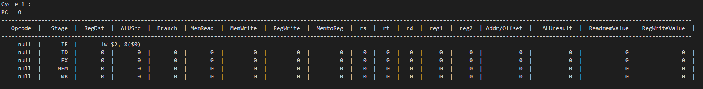

# MIPS_cpu_pipeline_simulate Project
## Use C++ to simulate MIPS CPU with five Stage Pipeline and Forwarding 
### 

# About pipeline_CPU_simulator Class
### The pipeline_CPU_simulator Class is used to execute input Mips Asm Code 
### First you can see `pipeline_CPU_simulator.h` to understand the variable and function briefly
### And then see `pipeline_CPU_simulator.cpp` which include the detail about all functions
### Last See `main.cpp` to knows about how arguments works
### The `main_without_oop.cpp` is the old version of this Project
### Below Fig is the pipeline_CPU_simulator Class Flowchart
### 

# Run Code

## Clone Repository and Use gcc Compile
```bash
git clone https://github.com/Yui-Arthur/MIPS_cpu_pipeline_simulate.git
cd MIPS_cpu_pipeline_simulate
g++ main.cpp pipeline_CPU_simulator.cpp -o main
```

## Use File as Input

```bash
./main ${FilePath}
# Example
./main sample_input/input1.txt
# Muti File Example
./main sample_input/input1.txt sample_input/input2.txt
# Output file 
./main ${FilePath} > ${Outputfile}
```
or

```bash
./main < ${FilePath}
# Example
./main < sample_input/input1.txt
# Output file 
./main < ${FilePath} > ${Outputfile}
```

## Use Stdin as Input

```bash
./main 
# input Mips Asm Code
# Ex. lw $2, 8($0)
```

# Output Format
### Show current PC and cycles then print the pipeline register (IF_ID , ID_EX , EX_MEM , MEM_WB) before this cycle 
### 
## Stage 
* IF - next instruction into IF Stage
* ID - IF_ID into ID Stage
* EX - ID_EX into EX Stage
* MEM - EX_MEM into MEM Stage
* WB - MEM_WB into WB Stage

## Signal and Value
* Opcode: instruction that specifies the operation to be performed
* Stage : IF, ID, EX, MEM, WB
* RegDst : selects the destination register (rt or rd)
* ALUSrc : selects the ALU input (rt or offset / addr)
* Branch : the operation is branch or not
* MemRead : the operation will read memory
* MemWrite : the operation will write memory
* RegWrite : the operation will write register
* MemtoReg : selects the source value for the register write (memReadValue or ALUresult)
* rs : source register
* rt : target register
* rd : destination register
* reg1 : rs register value
* reg2 : rt register value
* Addr/Offset : the offset of memory or the PC relative addr
* ALUresult : the value of ALU result
* ReadmemValue : the value of memory read
* RegWriteValue : the value of register write

