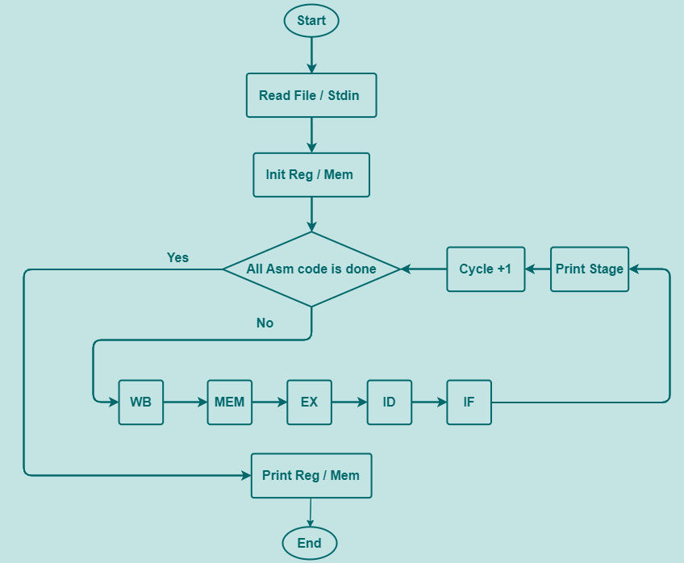

# MIPS_cpu_pipeline_simulate Project
## Use C++ to simulate MIPS CPU with five Stage Pipeline and Forwarding 
### 

# About pipeline_CPU_simulator Class
### The pipeline_CPU_simulator Class is used to execute input Mips Asm Code 
### First you can see `pipeline_CPU_simulator.h` to understand the variable and function briefly
### And then see `pipeline_CPU_simulator.cpp` which include the detail about all functions
### Last See `main.cpp` to knows about who arguments works
### The `main_without_oop.cpp` is the old version of this Project
### Below Fig is the pipeline_CPU_simulator Class Flowchart
### 

# Run Code

## Clone Repository and Use gcc Compile
```bash
git clone https://github.com/Yui-Arthur/MIPS_cpu_pipeline_simulate.git
cd MIPS_cpu_pipeline_simulate
gcc main.cpp pipeline_CPU_simulator.cpp -o main
```

## Use File as Input

```bash
./main ${FilePath}
# Example
./main sample_input/input1.txt
# Muti File Example
./main sample_input/input1.txt sample_input/input2.txt
# Output file 
./main ${FilePath} > ${Outputfile}
```
or

```bash
./main < ${FilePath}
# Example
./main < sample_input/input1.txt
# Output file 
./main < ${FilePath} > ${Outputfile}
```

## Use Stdin as Input

```bash
./main 
# input Mips Asm Code
# Ex. lw $2, 8($0)
```
